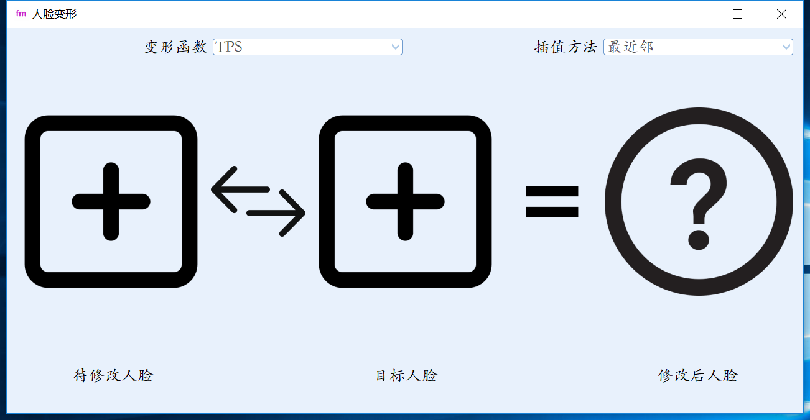
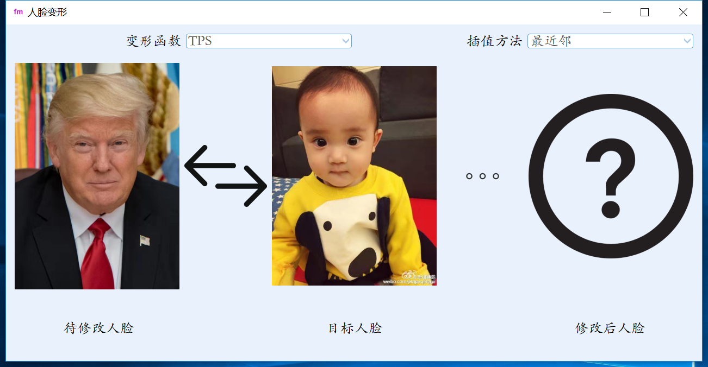
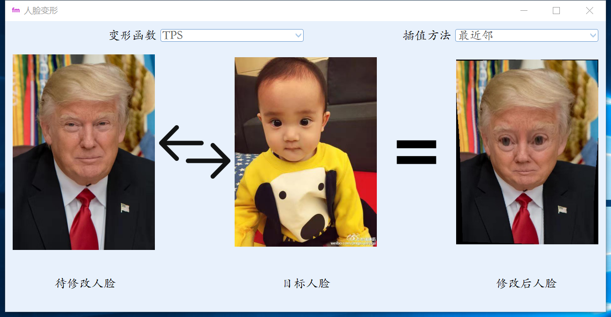
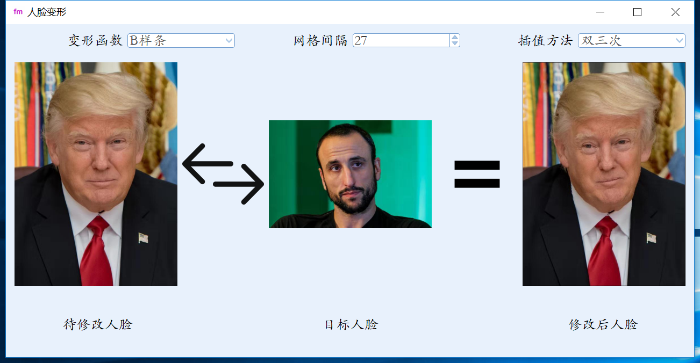

# 人脸变形

> 作者：赵文亮
>
> 班级：自64
>
> 学号：2016011452
>

## 运行环境

- Windows 10 x64
- [OpenCV 4.0.0-alpha](https://github.com/opencv/opencv/releases/tag/4.0.0-alpha)， [OpenCV-contrib 4.0.0 alpha](https://github.com/opencv/opencv_contrib/releases/tag/4.0.0-alpha)
- GUI使用Qt 5.9.3

## 运行方式

### 打开程序

- 在`bin`文件夹下，双击`FaceMorphing.exe`，程序初始界面如图所示：

  

  ​

  ​

### 载入图片

- 点击界面左边`加号`，可以添加待修改人脸图片；点击右边加号，可以添加目标人脸图片
- 载入图片后，点击图片可以重新载入图片
- 点击两张图片中间的中间的`互换`符号可以交换待修改人脸和目标人脸
- 点击`问号`可以指定变形结果的保存路径

### 人脸变形

- 点击`等号`开始人脸变形，此时`等号`变为`省略号`，表示正在变形，如下图所示：

  ​

  

  ​

- 变形结束后，`省略号`会变为`等号`，同时显示变形结果：

  ​

  

  ​

- 在`变形函数`下拉框中可以选择**TPS变形**或**B样条变形**，在`插值方法`下拉框中可以选择**最近邻**、**双线性**、**双三次**。选择B样条变形时，可以指定变形所用的网格间隔。如下图所示：

  ​

  

## 目录结构

- FaceMorphing/：源代码
- bin/：可执行文件FaceMorphing.exe所在目录
- picture/：示例图片
  - points/：人脸关键点。程序运行时会优先在这个目录下寻找人脸关键点文件，如果寻找失败会检测关键点并保存在此目录中
  - result/：运行结果。每次运行结果默认以`result/变形方式/插值方式/待修改人脸_to_目标人脸`的路径。例如`8.jpg`变形到`6.jpg`（使用TPS变形、最近邻插值）的保存路径为`result/TPS/nearest_neighbor`
  - screenshot/：程序运行截图，用于本说明文档
- model/：关键点检测所需的模型文件
- report.pdf：报告
